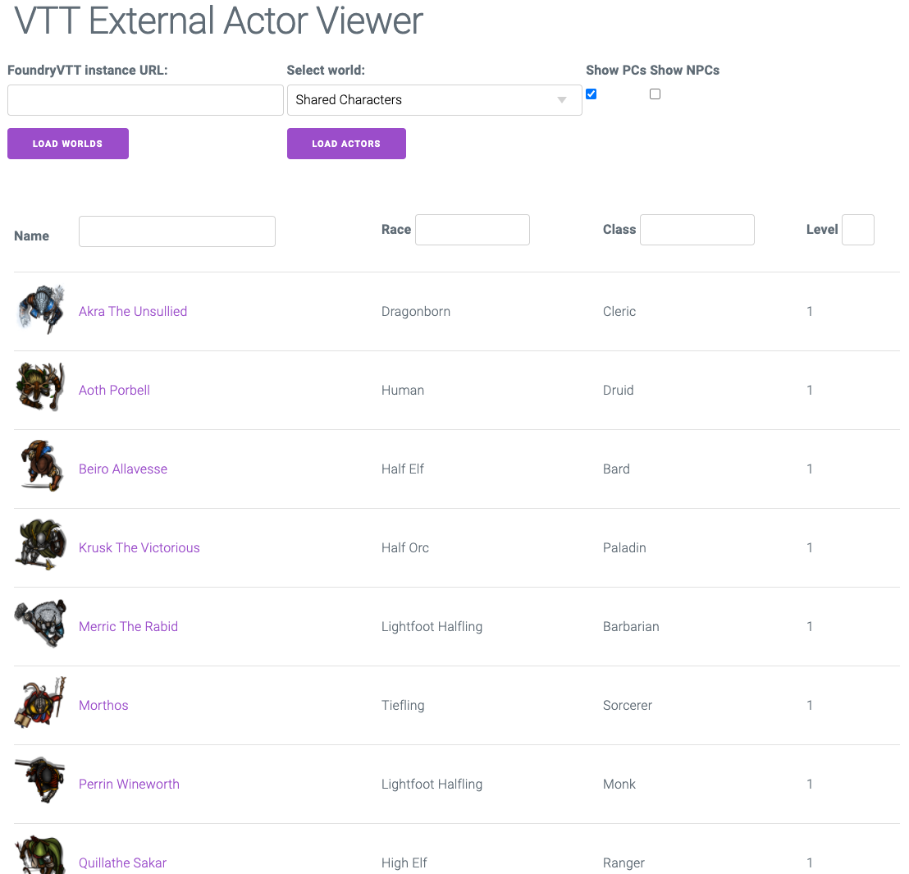

# Available Actors Viewer

This tool is to help players (and DMs) view their actors regardless of which world is running on your [FoundryVTT](https://foundryvtt.com/) instance. It makes heavy use of the [VTT External Actor Viewer](https://foundryvtt.com/packages/externalactor/) module as the source of the character JSON.

## Screenshot

## Assumptions

The following steps are based on the following assumptions:
1. Your FoundryVTT instance is running at `https://example.com:3000/`
2. You plan on accessing the Available Actors at `https://example.com:3000/actors/index.html`
3. You check this code out into your `/Data` path
4. You have a single world that contains all of the actors you want to see. If this is not the case, consider using a shared content compendium to bring all of the actors into a single place.

## How to use

1. Ensure that your FoundryVTT instance is running on a secure connection (`https`).
2. Create a world where you will import *all* of your characters.
  1. I named my world `Shared Characters` and set the data path to be `shared`. You will need to take note of the data path that you set.
  2. 
3. Install the [VTT External Actor Viewer](https://foundryvtt.com/packages/externalactor/) module and enable it on your `Shared Characters` world.
4. Import any and all of your actors into your world - for example those in the `Starter Heroes` compendium bundled with the 5e system.
  1. You should now automatically have a new folder and files in `/Data/actorAPI` including `/Data/actorAPI/<world-data-name>-actors.json`
6. Download the [Release](https://github.com/sneat/FoundryVTTActorViewer/releases) and extract into `/Data/actors/`
  1. You can extract this into any named folder.
  2. You must have the folder under the `/Data` folder as it allows your FoundryVTT instance to host it, bypassing the CORS issues.
7. Copy `config.json.example` to `config.json` and set the appropriate values.
  1. `siteURL`: Full domain address (including trailing slash) of where your FoundryVTT instance is running. It must be on a secure domain (`https`).
  2. `worldName`: The "Data Path" name of your world that contains all of your actors.
7. You should now have a working instance of the Playable Character Viewer at `https://example.com:3000/actors/index.html` (or whatever folder name you extracted it to)
   1. Simply update the actors in your "Shared Characters" world, and the page will pick it up automatically (thanks to the [VTT External Actor Viewer](https://foundryvtt.com/packages/externalactor/) module).
   2. If you are wanting updates from other worlds to show, replace the actor in the shared content compendium and re-import into the "Shared Characters" world.